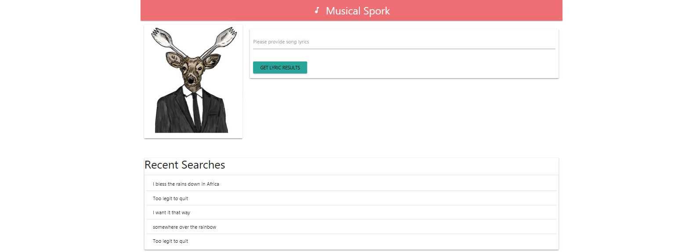
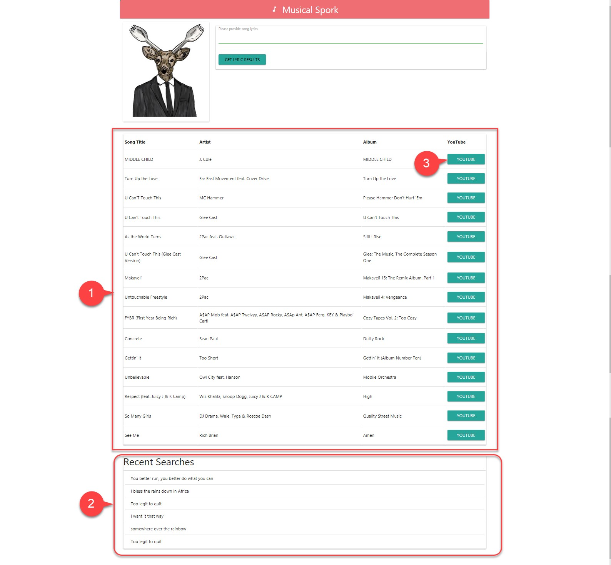
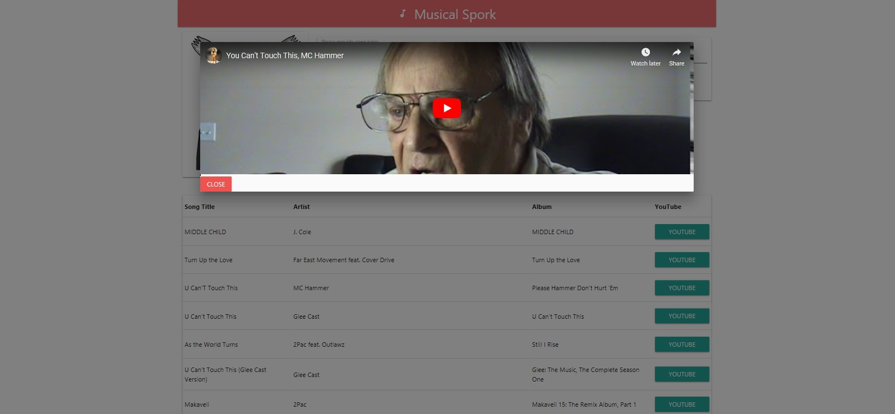

# Musical Spork

## Overview

Have you ever had a moment where there are some lyrics stuck in your head, but you just couldn’t recall the name of the song? Have you ever experienced hearing a beautiful song at a store and wished someone could tell you the name of that song?

Musical Spork can help with that! It is an online music search website that helps you find all the possible songs just based on one line of lyrics you provide. It also allows you to play any song within the webpage from the list of songs that have been retrieved. 

---

## Team Members

Julia Fercello, Derek Teed, David Kraft, Peter Wratkowski

---

## Deployed Link

https://peterwra.github.io/MusicalSpork/

---

## Technologies

APIs: MusixMatch, YouTube

Code: Ajax, Firebase, jQuery, Materialize

---

## Views

At the start page, it will display the most recent searches at the bottom of the page to see what people have been searching for. Enter some lyrics in the text box and click the 'Get Lyric Results' button to get the returns from MusixMatch.

1. The results from MusixMatch API is used to find the appropriate songs on YouTube.
2. Recent searches are stored in a Firebase database for reference.
3. Clicking on the YouTube button will bring up a modal with the video.

Due to copyright restrictions with YouTube, only those with a common creative license are allowed to be linked.

